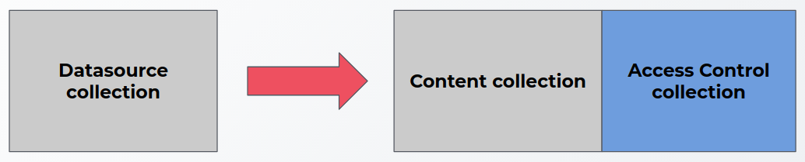
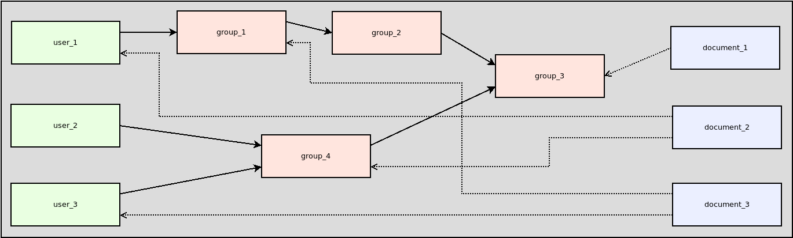
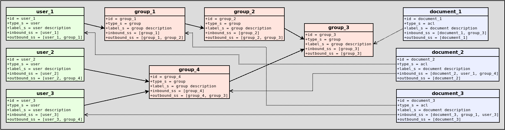

# SDK Security filtering
## Storage changes


- In the old approach, content documents and ACLs were stored in the same collection.
- In the new approach, ACLs are stored in an separate collection.

### Content collection

- This collection represents the datasource collection created by the parent app
- Content collection does not have ACLs information

### Access control collection

- Collection that will store permissions hierarchy
- Permissions hierarchy will be represented by a graph of normalized access control entities and document ACL entities.
    - Access control: it might represent a group, user, role, etc.
    - Document ACL: it represents the relation between a document with its access control permissions (binds this collection with the content collection)

## Access Control collection - Data model
### Access control entity

| Field | Description |
| ------- | ------- |
| id | ID of the access control |
| type_s | Type of access control (group, user, role assignment, role definition,, etc) |
| label_s | Description of the access control |
| outbound_ss | Outbound edges, i.e. parent objects can be represented with this fields |
| inbound_ss | Inbound edges i.e. list of access controls which are owned by the current access control |

### Document ACL entity

| Field | Description |
| ------- | ------- |
| id | ID of the document |
| type_s | A document ACL is an access control too, but with type “acl”. So for  document ACL entities, this field is always set to acl |
| label_s | Description of the document ACL |
| outbound_ss | Outbound edges, not commonly used |
| inbound_ss | Inbound edges, i.e. an Document ACL can inherit permissions through this field |

### Sample
#### Diagram representation


#### Graph representation


## Indexing time
### Contents / Documents indexing

- Documents are indexed as always to the content collection (No field “acl_ss”)

```java
    ctx.newContent(<DOCUMENT_ID>, <STREAM_SUPPLIER>)
        .withFields(<FIELDS>)
        .emit();
```

```java
    ctx.newDocument(<DOCUMENT_ID>)
        .withFields(<FIELDS>)
        .emit();
```

### Access controls / Document ACLs indexing

- Normalized ACLs will be stored into the access content hierarchy collection.

```java
    ctx.newAccessControlItem(<ACCESS_CONTROL_ID>, <TYPE>)
        .withLabel(<LABEL>)
        .withOutbound(<OUTBOUND_LIST>)
        .emit();
```

- Only documents or contents can index their ACLs

```java
    ctx.newDocumentACL(<DOCUMENT_ID>)
        .withLabel(<LABEL>)
        .withInbound(<INBOUND_LIST>)
        .emit();
```

### Supported operations

- Add or update an access control (full crawl - incremental crawling)
- Delete an access control (incremental crawling)
    - Delete access control in cascade
    - Delete access control children by depth
    - Delete access control by query

## Querying time

- Graph query parser and Join query parser will be used together to build the final filter query.
- Graph query parser will be used to filter access control items (groups, users, etc) in the hierarchy graph.
    - An implicit denormalization is not required at querying time, since the graph deals with this filtering.
- Join query parser will be used to join the access control collection with content collection.
    - ACL entities on access control collection will be used as means to join the ACLs with the content collection.

### Sample query

#### Old filter query sample
```
{!lucene q.op=OR} acl_ss:”user_2” acl_ss:”group_4” acl_ss:”group_3” ...
```

#### New filter query sample
```
{!join from=id to=id fromIndex=<DS_ID>_access_hierarchy}+{!graph from=inbound_ss to=outbound_ss}id:”user_2” +type_s:”acl”
```
## Required components

- Each plugin with support for security trimming must implement `AccessControlFetcher` component.
- The component must be registered in the plugin, i.e.

```
return ConnectorPlugin.builder(getPluginMetadata(), SharepointConfig.class)
        .withFetcher("content", SharepointContentFetcher.class, fetchModule)
        .withFetcher("access-control", SharepointAccessControlFetcher.class, fetchModule)
        .withConfigSuggester(SharepointConfigSuggester.class)
        .withValidator(SharepointValidationComponent.class, fetchModule)
        .withSecurityFilter(SharepointSecurityFilterComponent.class, fetchModule)
        .build();

```
