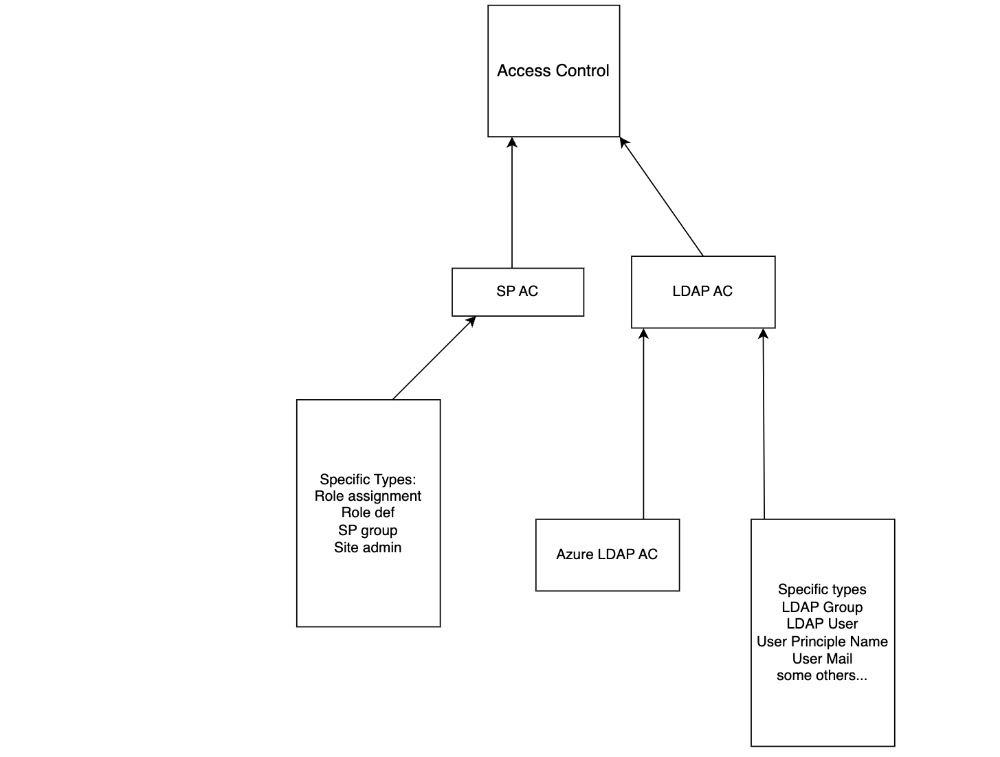

# Security filtering Connector

## Connector Description

The connector uses the connectors SDK to generate Access Control hierarchy and documents in order to demonstrate the 
Graph Security Trimming functionality.
The following steps are described below:
- How to build and deploy the security trimming connector.
- How to run the connector to generate Access Control documents and content documents.
- How to add the Graph Security Trimming stage to the Query Workbench to test security trimming.

## Background
The Graph Security Trimming SDK methods generate the security hierarchy used by the Graph Security Trimming (SGT)
stage of the query pipeline. In particular, for optimal efficiency, the SGT stage uses only top level filtering queries -
cross collections joins are not supported. To facilitate that, access control documents are created in the same collection where content
documents are created and a copy of each access control document is created on every active collection shard.

## The Access Control Hierarchy
The SGT SDK methods facilitate the creation of a hierarchy of _principals_. A _principal_ is an entity that has
certain access permissions to resources. In the context of Fusion, the most common entities are _users_ and _groups_ and 
the typical access permission is the document _read_ permission. The SGT SDK methods are abstract - they support
any _principal_ type and any permission. But this example demonstrate _users_, _groups_ and document _read_ permissions.

When security the SGT query pipeline stage is configured, documents are accessible only by principals who are specified
in the document's `_lw_acl_ss` list field. `user1` will be able to see the document only if it's specified 
in the `_lw_acl_ss` field, or if a group `user1` belongs to is specified in the `_lw_acl_ss` field. This access
authorization is transitive through group nesting.

When the sample connector populates a single shard collections it creates 6 documents:  2 users, 2 groups 
and 2 content documents.
- _user1_
- _user2_
- _group1_ with _user1_ as a member
- _group2_ with _user1_ and _user2_ as members.
- _doc1_ with _group1_ in its `_lw_acl_ss` permissions list.
- _doc2_ with _group2_ in its `_lw_acl_ss` permissions list.

This hierarchy means that _user1_ has access to both documents and _user2_ has access only to _doc2_.




## Building and Deploying the Connector Plugin

1. Clone the repo:
```
git clone https://github.com/lucidworks/connectors-sdk-resources.git
cd connectors-sdk-resources/java-sdk/connectors/security-filtering-connector
../gradlew assemblePlugin
```

2. This produces one zip file, named `security-filtering-connector.zip`, located in the `security-filtering-connector/build/plugins` directory.
This artifact is now ready to be uploaded directly to Fusion as a connector plugin.

3. Use Fusion admin `System -> Blobs` tab to upload and deploy the connector's zip file.
   Or see the following [instructions](../README.md) on how to build and deploy the plugin.


## Configuring and Running the Connector
- After deploying the plugin zip, wait for `Security Connector Demo` to be under the _Installed_ list of the `Indexing -> Datasources-> Add+` tab.
  It could take about a minute.

Create a data source with this configuration:

- set to _create_ the CRUD OPERATION option under CRAWL PROPERTIES.
- set to _NA_ the CRUD OPERATION option under CRAWL PROPERTIES.
- Run the connector and wait for it to finish successfully. 
- Use the Query Workbench to observe the 6 created documents.

**Note the SOME-NAME___N document id naming convention of Access Control documents. N represents the shard#.
When the collection has a single shard, N will be 0 e.g. _user1___0_.**

## Security trimming stage (Query time)
After the connector run, the documents are ready for testing query security trimming.

## Multiple Shard Collections

## Deleting Access Documents

## Code Observations


## ACL Collection Observations
After running the connector, you can observe the ACL collection documents generated by SecurityFilteringAccessControlFetcher. Use the Collection Manager
to find the ACL collection. Its name will be `{DATASOURCE_ID}_access_control_hierarchy` if you kept the default name. 
Use the Query Workbench
to list the documents and see how the field values correspond to the code that explained above.

- Observe the permission, user and group documents.
- Show all the document's fields and see how inbound permission fields point to users and groups.
- Observe how the outbound field of users with group memeberships point to the group(s).
- Observe the fullName_s field of users and groups that correlate it to the logged-in principal at search time.


