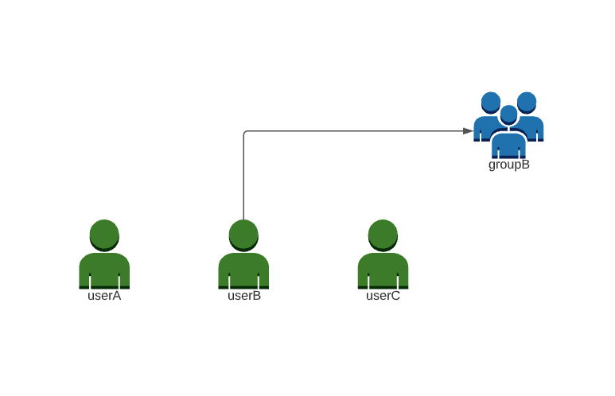
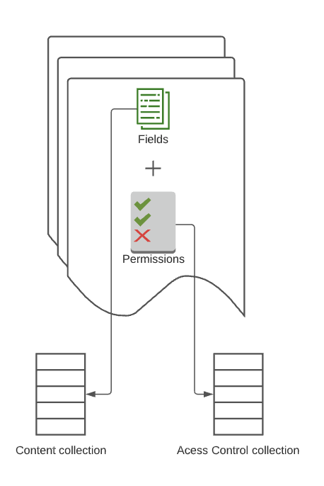
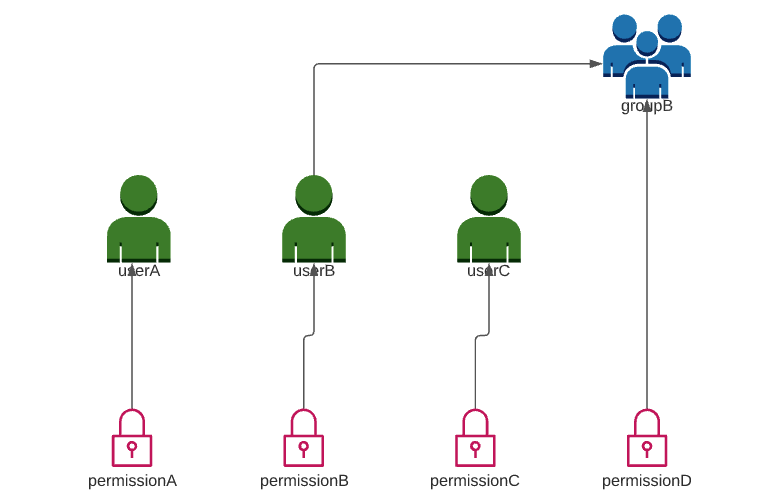

# Security filtering Connector

## Connector Description

- This connector generates a configurable number of content collection documents and a static ACL hierarchy. The Static hierarchy means that all the information needed for security filtering (a.k.a security trimming) is stored in Fusion a collection. Fusion doesn't need to call connector plugin code at search time.
- The ACL Documents fetcher is implemented in `SecurityFilteringAccessControlFetcher` class. This fetcher retrieves permission documents, groups and users.
- The documents indexed by the access control fetcher are stored by default in the collection: `{DATASOURCE_ID}_access_control_hierarchy` where the `DATASOURCE_ID` is the id of the configuration.

### Access Control Fetcher behavior

Access control hierarchy used here is static and structured in the following way:



Every content document consists of fields (your regular data) and permissions (ACL information).



Every permission is emitted as a separate ACL document which connects content documents to access control hierarchy.
Note that the content document ACL field can point directly to a principal document (user/group) rather than an ACL document -
that can work for simple cases. But typically, the more complex permission hierarchy requires ACL documents. 




## Quick start

1. Clone the repo:
```
git clone https://github.com/lucidworks/connectors-sdk-resources.git
cd connectors-sdk-resources/java-sdk/connectors/
./gradlew assemblePlugins
```

2. This produces one zip file, named `security-filtering-connector.zip`, located in the `security-filtering-connector/build/plugins` directory.
This artifact is now ready to be uploaded directly to Fusion as a connector plugin.

3. See the following [instructions](../README.md) on how to build, deploy, and run the plugin.


## Connector properties

### Main properties

### Security trimming properties

|Property Name| Property description|
|---|---|
| Enable security trimming | When enable, the access control fetcher will be executed |
| ACL collection name | The name of the collection where the documents indexed by access control fetcher will be indexed |

### Content generator properties

|Property Name| Property description|
|---|---|
| Total | The total number of documents to generate |
| Minimum number of sentences | The minimum number of sentences to generate per document, the random generator will use this value as lower bound to calculate a random number of sentences|
| maximum number of sentences | The maximum number of sentences to generate per document, the random generator will use this value as upper bound to calculate a random number of sentences|

## Code Observations

- The job run uses two phases: The first phase is used by SecurityFilteringContentFetcher to create documents in the content collection
  and create candidates for the security documents (permissions users and groups). The second phase is used by 
  SecurityFilteringAccessControlFetcher to create security documents. The phases are created in SecurityFilteringPlugin with
  this code that creates the CONTENT phase for SecurityFilteringContentFetcher and the ACCESS_CONTROL phase 
```java
   return ConnectorPlugin.builder(SecurityFilteringConfig.class)
    .withFetcher(CONTENT, SecurityFilteringContentFetcher.class, fetchModule)
    .withFetcher(ACCESS_CONTROL, SecurityFilteringAccessControlFetcher.class, fetchModule)
```
SecurityFilteringContentFetcher sends the document to the second phase with:
```java
      fetchContext.newCandidate(permission.getId())
       .withTargetPhase(ACCESS_CONTROL)
```
- Observe how user memberships in a group is created by setting an outbound field in the user document that 
points to the group(s):
```java
    outbound = Collections.singletonList(parentGroup);
    ...
    context.newAccessControl(input.getId())
    ...
    .addAllOutbound(outbound)

```
- Observe how principals (users and groups) are set in the permission document using the inbound field:
```java
   context.newAccessControl(input.getId())
    ...
    .addAllInbound(Collections.singletonList(assigned))

```
- Observe how permissions are correlated to the logged-in user at search time through the withPrincipal method
in SecurityFilteringPlugin:
```java
  .withSecuritySpec(sf -> sf
        .staticSpec(spec -> spec
        .withPrincipal("fullName_s")))

```
## ACL Collection Observations
After running the connector, you can observe the ACL collection documents generated by SecurityFilteringAccessControlFetcher. Use the Collection Manager
to find the ACL collection. Its name will be `{DATASOURCE_ID}_access_control_hierarchy` if you kept the default name. 
Use the Query Workbench
to list the documents and see how the field values correspond to the code that explained above.

- Observe the permission, user and group documents.
- Show all the document's fields and see how inbound permission fields point to users and groups.
- Observe how the outbound field of users with group memeberships point to the group(s).
- Observe fullName_s field of users and groups that correlate it to the logged-in principal at search time.

## Security trimming stage (Query time)

After indexing documents in the content and access control collections, we can run a search query to filter the results based on a username.
First, we need to add the `Security Trimming` query stage to the query pipeline and configure it.

Check the access control collection to review which users and groups were indexed.
